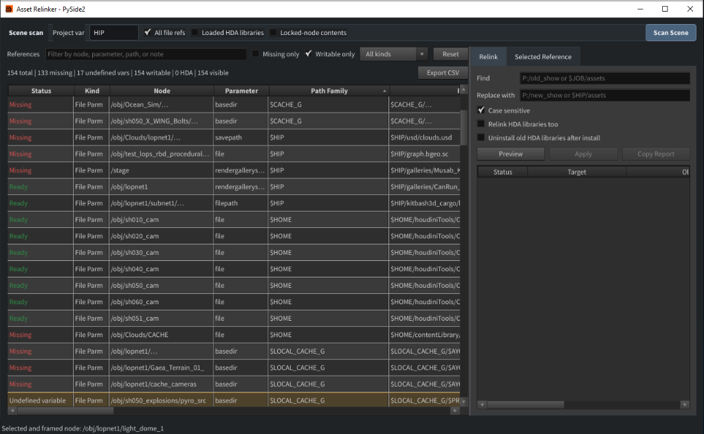

# Houdini Asset Relinker

A friendly Python tool for auditing, finding, and replacing external asset paths (like textures, geometry caches, USD files, and HDAs) in your current Houdini session.

---

## What It Does

When working on large Houdini scenes, asset paths can easily break when projects move or local drive letters change. This tool helps you:

- **Scan** the entire scene to list all external file paths.
- **Identify** broken paths (marked in red as `Missing`).
- **Search & Filter** to find specific nodes or parameters.
- **Find & Replace** paths safely across all nodes in the scene.
- **Relink HDAs** (custom digital asset libraries) and manage library installation.

---

## How to Open the Tool

Once installed by your pipeline TD, you will find the tool on your Houdini shelf:

1. Open your Houdini Shelf set.
2. Click the **Asset Relinker** shelf tool.
3. This opens a floating window where you can run scans and perform operations.

*For installation, programmatic usage, or local development details, please see the [Developer & Technical Guide](DEVELOPER.md).*

---

## How to Use (Step-by-Step)

### Step 1: Scan Your Scene

1. Click **Scan Scene** at the top right to analyze the current session.
2. Under **Project var**, specify your main project directory variable (e.g., `HIP` or `JOB`).
3. You can customize the scan with these options:
   - **All file refs**: Audit every file reference.
   - **Loaded HDA libraries**: Scan for custom digital asset libraries.
   - **Locked-node contents**: Scan parameters inside locked HDAs.

### Step 2: Inspect and Filter

Once scanned, you will see a list of references with statuses:

- 🟢 **Ready**: The file exists and is located at the correct path.
- 🔴 **Missing**: An inbound dependency cannot be found on disk.
- 🟡 **Undefined variable**: The path contains an environment variable that is not set in the current session.
- 🟠 **Generated output**: A render/cache/export destination is kept visible for context but is not treated as a broken relink target.

Use the search bar at the top to filter paths by node names, parameters, or path text. Check **Broken targets** to focus on inbound dependencies that need relinking.

### Step 3: Find & Replace Paths

To update multiple paths at once:

1. Go to the **Relink** tab on the right side.
2. In the **Find** field, enter the old path prefix (e.g., `P:/old_show` or `D:/temp`).
3. In the **Replace with** field, enter the new path (e.g., `P:/new_show` or `$HIP/assets`).
4. Review the planned changes in the live preview table below.
5. Review the changes, then click **Apply** to run the update on your scene parameters.

---

## Safety Notes

- **Backup**: Always save a backup copy of your `.hip` file before applying large path replacements.
- **Limit Scope**: Keep the relink scope on the smallest useful target set before previewing and applying.
- **HDA Uninstall**: When relinking HDA libraries, checking *Uninstall old HDA libraries* will automatically clean up the old library paths from the session.
